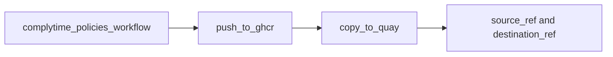

# complytime-policies

Centralized [Gemara](https://github.com/gemaraproj/gemara) policies for [ComplyTime](https://github.com/complytime) tooling. Content is published as OCI to **Quay.io** and consumed with `complyctl get` (and similar clients).

## Repository Structure

This repository contains governance artifacts used to define and enforce security controls across supported platforms (GitHub, GitLab, etc.). The governance content follows the [Gemara](https://github.com/gemaraproj/gemara) framework and is organized into catalogs, guidance, and policies.

```
complytime-policies
├── AGENTS.md
├── bundles                # Declarative manifests defining which layers compose each OCI artifact
├── complytime-content     # Mapping documents expressing relationships to external frameworks
├── governance
│   ├── catalogs           # Security control catalogs and definitions
│   ├── guidance           # Guidance catalogs documenting best practices and standards
│   └── policies           # Implementation policies and technical controls
├── LICENSE
└── README.md
```



### Guidance

Guidance catalogs are a structured set of guidelines -- recommendations, requirements, or best practices -- that help readers achieve desired outcomes. Guidelines are grouped into groups.

- [CIS Fedora Linux Level 1 Benchmark Guidance](governance/guidance/cis-fedora-l1-guidance.yaml)

## Releasing

Manual publish: [`.github/workflows/publish-policy-oci.yml`](.github/workflows/publish-policy-oci.yml) (Actions --> **Publish policy OCI**). Operator steps, inputs, and the pinned action are documented in [`specs/001-policy-oci-publish/quickstart.md`](specs/001-policy-oci-publish/quickstart.md).

**Secrets (repository):** `QUAY_ROBOT_USERNAME`, `QUAY_ROBOT_TOKEN`. GHCR uses `GITHUB_TOKEN` from the workflow. Forks need their own secrets.

**Verification behavior:** successful runs now include destination digest, manifest media type, and
layer retrievability checks against Quay API endpoints. If Quay package UI appears sparse for custom
media types, use workflow verification output and quickstart API checks as the source of truth.

## Usage

```bash
complyctl get
```

## License

Apache-2.0. See [LICENSE](LICENSE).
